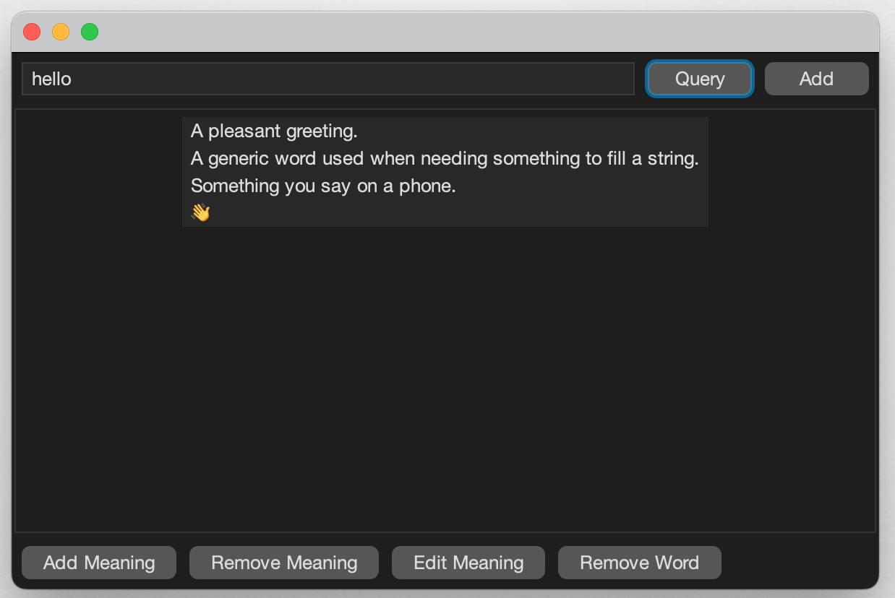
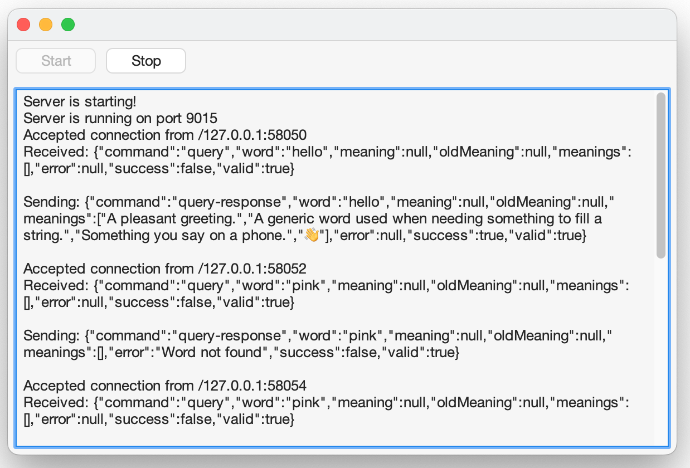

# Dictionary Server and Client

## Overview

This project implements a multi-module dictionary application using Java and Maven. It includes:
- Dictionary Server: A multi-threaded server that provides dictionary services.
- Dictionary Client: A graphical user interface (GUI) for interacting with the dictionary.
- Shared Module: Common code shared between the server and client.

The application uses MySQL for data storage and Maven for dependency management and project structure. 

## Features

### Client
- User-friendly GUI: Built with Java Swing and styled with FlatLaf.
- Supported Actions:
    - Query word meanings.
    - Add new words.
    - Remove words.
    - Edit and remove specific meanings.
- Unicode Support: Allows Unicode characters, including emojis.

### Server
- Multi-threaded: Uses a thread pool to handle multiple client requests concurrently.
- Database Integration: Interacts with a MySQL database for scalable and persistent storage.
- Logging: Includes server-side logging using log4j2 for monitoring and debugging.

### Shared Module
- Contains the Message class for structured client-server communication using JSON serialisation.

## Technical Details

### Project Structure
```
dictionary/
├── pom.xml         # Parent POM
├── client/         # Client-specific code and resources
│   └── pom.xml
├── server/         # Server-specific code and resources
│   └── pom.xml
├── shared/         # Shared code and resources
│   └── pom.xml
```

### Maven Configuration
- Parent POM: Manages dependencies and configurations for all modules.
- Server: Includes dependencies for MySQL (Connector/J), logging (log4j2), and environment configuration (dotenv-java).
- Client: Includes GUI styling dependencies (FlatLaf).
- Shared Module: Includes JSON serialization (Jackson).

## Requirements
- Java 21
- MySQL
- Maven

## Setup Instructions

1. Clone the Repository
```
git clone <repository_url>
cd Distributed-dictionary/dictionary
```

2. Set Up the Database
```
mysql -u <username> -p ds_dictionary < dictionary_schema_and_data.sql
```
Also, put your credentials into an `.env` file so the server can access the database.

3. Build the Project
Run the following Maven command from the `dictionary` directory:
```
mvn clean package
```
This creates runnable `.jar` files for the client and server in their respective `target/` directories:
- `server/target/server-1.0-SNAPSHOT-jar-with-dependencies.jar`
- `client/target/client-1.0-SNAPSHOT-jar-with-dependencies.jar`

4. Rename and Copy the JAR Files
Move and rename the JAR files to the root `dictionary/` directory:
```
cp server/target/server-1.0-SNAPSHOT-jar-with-dependencies.jar DictionaryServer.jar
cp client/target/client-1.0-SNAPSHOT-jar-with-dependencies.jar DictionaryClient.jar
```

5. Run the Server
```
java -jar DictionaryServer.jar
```

6. Run the Client
```
java -jar DictionaryClient.jar <host> <port>
```

## Screenshots
### Client


### Server


